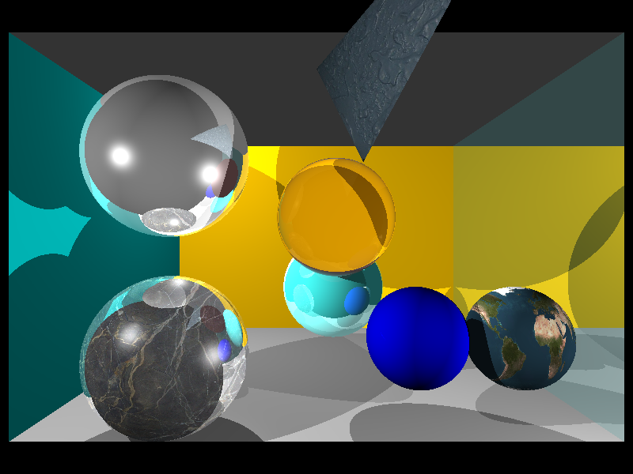
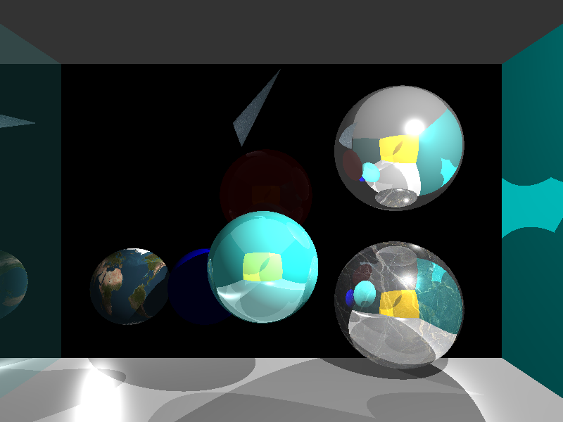
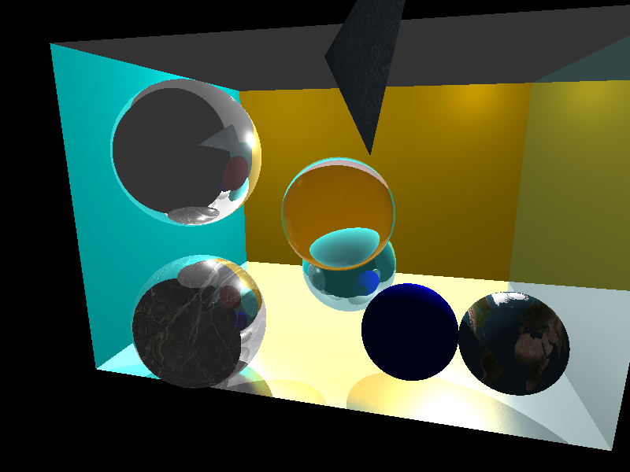
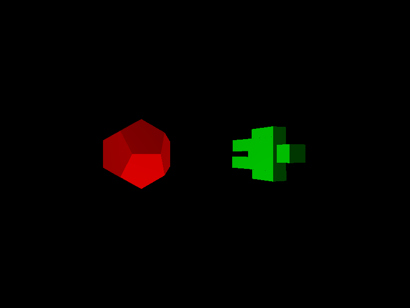

# RayPy

**This is an old university project.**

RayPy a ray tracer engine written in python.

### Dependencies
* Python 3.6
* Numpy
* Pillow

### Features
* Camera position
* Multiple spot light
* Sphere
* Triangular mesh
* Glossy surface
* Texture
* Bump mapping
* Reflection
* Refraction
* Object file
* Antialiasing

Some outputs:

